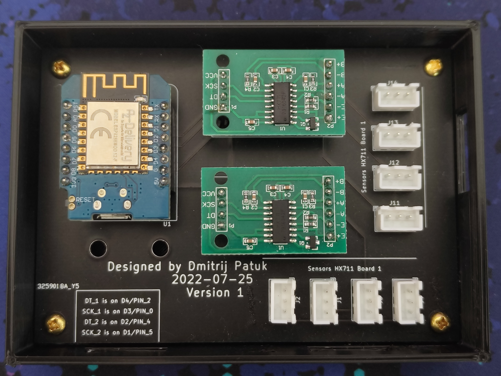

# Bed Occupancy Sensor
Contains the code for my custom bed occupancy sensor to use for home automations that require the knowledge of 
a bed being occupied.

  

The sensor uses ESPHOME in combination with a ESP8266 controller and two HX711 sensors.\
It is able to transmit the weight of two zones over MQTT or the native API.

## Native API
This device can use the native Home Assistant API and directly appear as an integration inside your HA instance.
For usage with `native api` uncomment the `<<: !include base/api.yaml` and comment the `<<: !include base/mqtt.yaml` lines inside `Configuration.yaml`
This will include the API Configuration. You will need to set the mqtt-Configuration inside `/base/secrets.yaml` file    

### Sensors
This will create two sensors called `first` and `second` inside your Device as soon as you include its integration in your HA instance.

## MQTT 
For usage with `MQTT` uncomment the `<<: !include base/mqtt.yaml` and comment the `<<: !include base/api.yaml` lines inside `Configuration.yaml`
This will include the MQTT Configuration. You will need to set the mqtt-Configuration inside `/base/secrets.yaml` file  
  
### Topics
This will create the following topics that you can subscribe to. 
* bed-occupancy/debug
* bed-occupancy/status
* bed-occupancy/sensor/first/state
* bed-occupancy/sensor/second/state
  
## Calibration
You can calibrate the sensor by changing the devider instide the filters of each sensor in 'Configuration.yaml'.
